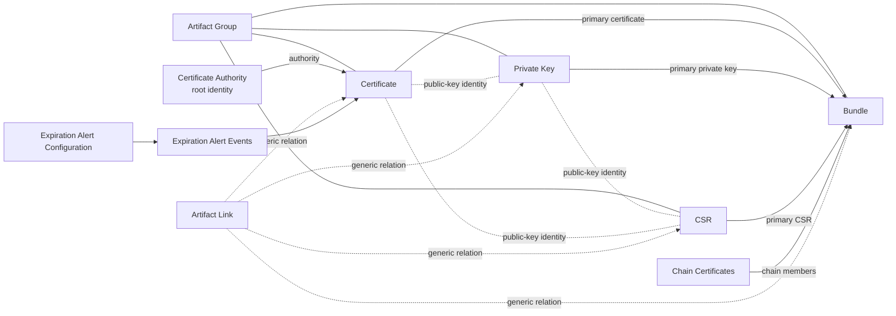

NetBox Certificates Plugin


NetBox Certificates Plugin adds X.509 certificate inventory, encrypted private-key storage, CSRs, cryptographic bundles, root CA identities, hierarchical artifact groups, relationship tracking, import/export workflows, and certificate-expiration alerting to NetBox.
> **AI-assisted development disclosure:** Substantial portions of the initial implementation, testing strategy, technical documentation, and release engineering for this project were produced with assistance from **ChatGPT by OpenAI**, under human direction and review. The human maintainer is responsible for the code and releases. OpenAI does not maintain, sponsor, or endorse this project. See [AI_ASSISTANCE.md](AI_ASSISTANCE.md) and [NOTICE](NOTICE).
Release status
Current release: 0.4.11
This release has been extensively validated on NetBox 4.5.9. The plugin declares compatibility with NetBox 4.5.9 through 4.5.10.
Compatibility
NetBox version	Status	Reason
4.5.9	Validated / supported	Full live integration, API, cryptographic, authentication, and ObjectPermission testing was performed on 4.5.9.
4.5.10	Supported by compatibility gate	Same 4.5 patch series; 4.5.10 is a bug-fix release. It has not received the same exhaustive live validation as 4.5.9.
4.5.8 and below	Unsupported / rejected	`PluginConfig.min_version` is 4.5.9. NetBox 4.5.9 also fixed constrained ObjectPermission scope filtering, which this plugin relies on.
4.6.0 and above	Unsupported / rejected	`PluginConfig.max_version` is 4.5.10. NetBox 4.6 moved to Django 6.0 and introduced/deprecated plugin APIs; a separate compatibility release and test cycle is required.
Additional requirements:
Python 3.12+
`cryptography >= 42`
NetBox 4.5 itself requires Python 3.12, 3.13, or 3.14. This plugin's production validation was performed with Python 3.12.
> **Important:** Do not bypass the NetBox version gate in production. A future NetBox minor release can change plugin APIs even when the Python package imports successfully.
Installation
The recommended production installation method is PyPI through NetBox's persistent `/opt/netbox/local_requirements.txt` workflow.
The PyPI distribution name is `netbox-certificates-plugin`. The NetBox plugin module name is `netbox_certificates`.
1. Add the package to NetBox local requirements
Add the following line to `/opt/netbox/local_requirements.txt`:
```text
netbox-certificates-plugin==0.4.11
```
For optional RAR import support, use:
```text
netbox-certificates-plugin[rar]==0.4.11
```
Then run NetBox's normal upgrade process:
```bash
cd /opt/netbox
sudo ./upgrade.sh
```
This installs the plugin from PyPI into NetBox's Python virtual environment and ensures it will be reinstalled when NetBox rebuilds that environment.
2. Generate the encryption key
The plugin requires a Fernet encryption key for protecting private-key material and other stored secrets.
Generate one using the same Python/cryptography environment used by NetBox:
```bash
/opt/netbox/venv/bin/python - <<'PY'
from cryptography.fernet import Fernet
print(Fernet.generate_key().decode())
PY
```
Store the generated key securely.
> **Critical:** Back up the encryption key separately from the database. Do not casually rotate or replace it after storing encrypted data. Existing encrypted Private Keys, SMTP passwords, webhook URLs/tokens, and other plugin secrets become undecryptable if the key changes without a migration/re-encryption procedure.
3. Enable and configure the plugin
Edit NetBox's `configuration.py`.
Add the plugin module to `PLUGINS`:
```python
PLUGINS = [
    # Other plugins...
    "netbox_certificates",
]
```
Add the required plugin configuration:
```python
PLUGINS_CONFIG = {
    # Other plugin configuration...

    "netbox_certificates": {
        "encryption_key": "YOUR_FERNET_KEY",
    },
}
```
Replace `YOUR_FERNET_KEY` with the Fernet key generated in the previous step.
4. Verify the NetBox configuration
Run:
```bash
cd /opt/netbox

sudo -u netbox \
  /opt/netbox/venv/bin/python \
  /opt/netbox/netbox/manage.py check
```
The command should complete without errors related to `netbox_certificates`.
5. Apply the plugin database migrations
Run:
```bash
cd /opt/netbox

sudo -u netbox \
  /opt/netbox/venv/bin/python \
  /opt/netbox/netbox/manage.py \
  migrate netbox_certificates
```
6. Collect static files
Run:
```bash
cd /opt/netbox

sudo /opt/netbox/venv/bin/python \
  /opt/netbox/netbox/manage.py \
  collectstatic --no-input
```
7. Restart NetBox
Restart both the NetBox web service and worker:
```bash
sudo systemctl restart netbox netbox-rq
```
Verify both services are running:
```bash
sudo systemctl --no-pager --full status netbox netbox-rq
```
The SSL Certificates plugin should now appear in the NetBox interface.
8. Verify the installed package
Run:
```bash
/opt/netbox/venv/bin/python -m pip show netbox-certificates-plugin
```
The output should include:
```text
Name: netbox-certificates-plugin
Version: 0.4.11
Location: /opt/netbox/venv/lib/python3.12/site-packages
```
A normal PyPI installation should not show an `Editable project location`.
> If `/opt/netbox/upgrade.sh` is run after the plugin is already enabled and configured, NetBox may already perform migration and static-file steps during the upgrade. Re-running the targeted migration and `collectstatic` commands above is safe and makes the final state explicit.
Why this plugin exists
NetBox is excellent at modeling infrastructure, but it does not natively model the complete cryptographic lifecycle of certificates, private keys, CSRs, matching identities, exportable bundles, and expiration-delivery history.
This plugin adds that layer while using NetBox-native concepts such as PrimaryModel metadata, owners, tags, custom fields, ObjectPermissions, REST APIs, jobs, and change logging.
The plugin is designed for operators who need to answer questions such as:
Which certificates are about to expire?
Which private key belongs to a certificate or CSR?
Is a bundle cryptographically complete?
Which objects were imported together?
Which root CA does a certificate chain resolve to?
Who may view metadata versus download sensitive material?
Can a non-admin export a public bundle without gaining access to a private key?
Which expiration notifications were actually delivered?
Data model and core objects

Certificate
Represents an X.509 certificate and stores the parsed cryptographic metadata required for inventory and expiration management.
Important fields include SHA-256 fingerprint, public-key fingerprint, serial number, subject, issuer, SANs, validity window, signature algorithm, key type/size/curve, CA flag, root CA identity, parent/supersession relationships, owner, groups, tags, and alert trigger settings.
Certificate material is stored because certificates are public objects by design. Downloading it through the protected download action still requires the plugin's custom download permission and a write-enabled NetBox API token for API access.
Private Key
Represents a private key. Raw private-key material is never exposed in normal list/detail serializers. It is encrypted before database storage using a Fernet key supplied through `PLUGINS_CONFIG`.
The model records metadata such as SHA-256 material fingerprint, public-key fingerprint, key type/size, import-encryption state, groups, owner, tags, description, and comments.
Private-key material has an additional security boundary: creation/replacement/download of material through the API is restricted to a NetBox superuser using a write-enabled API token, even when a normal user has the model's add/change/download ObjectPermission.
CSR
Represents a PKCS#10 Certificate Signing Request. The plugin parses subject, SANs, signature algorithm, key properties, request fingerprint, and public-key fingerprint.
The public-key fingerprint allows a CSR to be matched to a certificate and/or private key.
The UI/API can also generate a CSR and a matching private key. Because generation creates private-key material, the generation action is superuser-only through the API.
Bundle
A Bundle represents a set of cryptographic objects sharing the same public-key identity.
The three primary artifacts are:
Certificate
Private Key
CSR
A Bundle is:
Partial when any two matching primary artifacts are present.
Complete only when all three matching primary artifacts are present.
A Bundle can additionally hold chain certificates, import metadata, source/archive format, an optional preserved encrypted archive, groups, owner, tags, description, and comments.
Direct REST `POST` to the Bundle endpoint is intentionally disabled. Use Import Objects (`/import-objects/`) so cryptographic identity validation occurs before the Bundle is created.
Certificate Authority
Represents a root CA identity derived from imported self-signed root certificates. It is not a second copy of a certificate.
Certificates point to the resolved root authority when a complete root path can be established.
The REST Certificate Authority endpoint is intentionally read-only. CA identities are maintained from certificate material rather than manually created through the API.
Artifact Group
A user-managed hierarchical grouping mechanism for Certificates, Private Keys, CSRs, and Bundles.
Groups can have a parent group; cycles and self-parenting are rejected.
Groups are independent of NetBox authentication groups. `ArtifactGroup` is an inventory organization object; `users.Group` is an authorization object.
Artifact Link
Represents a generic relationship between supported artifact objects.
Links may be:
automatic, generated from cryptographic relationships; or
manual, created by an operator.
Automatic links cannot be changed/deleted through the REST API. Manual links can be managed when the user has the appropriate ObjectPermission and can see both endpoints.
Expiration Alert Configuration
A singleton object controlling the expiration worker policy and notification transport configuration.
It includes scan interval/repeat behavior, SMTP configuration, webhook configuration, and encrypted transport secrets.
The singleton cannot be deleted through the API. Disable the configured delivery methods instead.
Expiration Alert Event
A delivery-history record generated by the expiration worker for a certificate/method/trigger occurrence.
Events are intentionally read/delete only through the API; operators do not create or edit them manually.
Imports and cryptographic matching
The Import Objects workflow inspects uploaded content instead of trusting the filename extension.
Supported content includes:
PEM/DER X.509 certificates
Private keys
CSRs
PKCS#7/CMS containers
PKCS#12/PFX
Supported archives
Optional RAR support is available through the `rar` package extra.
The main safety rule is the public-key fingerprint. A certificate, private key, and CSR may become primary members of the same Bundle only when their public keys match.
A mismatched primary set is rejected atomically: the transaction is rolled back rather than leaving partially-created artifacts.
Current upload limits are:
Combined upload: 25 MiB
Archive entries: 250 files
Maximum uncompressed archive content: 100 MiB
Export behavior
Bundles can be exported as ZIP or TAR.
Public-only bundles may be exported by authorized non-superusers. If the Bundle contains a Private Key, export becomes a sensitive operation and requires superuser access through the API.
PFX/PKCS#12 export requires a Certificate, matching Private Key, and password, and is always treated as a sensitive operation.
Downloaded sensitive responses set cache-prevention/security headers, and archive members containing cryptographic material are created with restrictive file modes.
UI
The plugin base URL is:
```text
/plugins/ssl-certificates/
```
Important routes:
`expiration-dashboard/` — expiration overview
`inventory/` — consolidated artifact inventory
`certificate-authorities/` — root CA identities
`certificates/` — certificate management
`private-keys/` — private-key metadata management
`csrs/` — CSR management and generation
`bundles/` — Bundle management/export
`groups/` — hierarchical artifact groups
`import/` — unified import
`expiration-alerts/` — alert configuration/history
Most PrimaryModel objects support NetBox-native filtering, bulk editing, ownership, tags, custom fields, descriptions/comments, and change logging.
REST API
The API base is:
```text
/api/plugins/ssl-certificates/
```
See docs/API.md for endpoint details, authentication rules, custom actions, examples, status-code behavior, and security restrictions.
Permissions and security
This plugin uses NetBox ObjectPermissions. Standard CRUD actions use NetBox's native actions (`view`, `add`, `change`, `delete`). The plugin also defines custom actions.
Standard and custom actions
Object	Standard actions	Custom action string	Django permission codename
Artifact Group	view/add/change/delete	—	—
Certificate Authority	view/add/change/delete*	—	—
Certificate	view/add/change/delete	`download`	`netbox_certificates.download_certificate`
Private Key	view/add/change/delete	`download`	`netbox_certificates.download_privatekey`
CSR	view/add/change/delete	`download`	`netbox_certificates.download_csr`
Bundle	view/add/change/delete	`export`, `export_pfx`	`netbox_certificates.export_bundle`, `netbox_certificates.export_pfx_bundle`
Artifact Link	view/add/change/delete	—	—
Expiration Alert Configuration	view/add/change	`test`	`netbox_certificates.test_expiryalertconfiguration`

Expiration Alert Event	view/delete	—	—
`*` The Certificate Authority model has normal model permissions, but its REST API is deliberately read-only. A permission does not override an endpoint's method contract.
Creating permissions in the NetBox UI
Go to Admin → Object Permissions and create a permission with:
The plugin object type(s).
One or more users/groups.
Standard actions and/or the custom action.
Optional JSON constraints.
On NetBox versions where a plugin custom action is not shown as a dedicated checkbox, use the ObjectPermission form's Additional actions field and enter the action string exactly as listed above: `download`, `export`, `export_pfx`, or `test`.
Custom actions still require the object's view scope to resolve the target object. In practical terms, grant the corresponding `view` action together with a custom action unless the user already receives view permission from another ObjectPermission.
Creating custom-action ObjectPermissions from the shell
The following example creates permissions directly using NetBox's real ObjectPermission objects. It is useful when the NetBox 4.5 UI does not surface a plugin action the way you want.
```bash
cd /opt/netbox
sudo -u netbox ./venv/bin/python ./netbox/manage.py shell <<'PY'
from core.models import ObjectType
from users.models import Group, ObjectPermission
from netbox_certificates.models import Certificate, CSR, Bundle

operator_group = Group.objects.get(name="Certificate Operators")


def grant(name, model, actions, constraints=None):
    permission, _ = ObjectPermission.objects.get_or_create(
        name=name,
        defaults={
            "enabled": True,
            "actions": list(actions),
            "constraints": constraints or {},
        },
    )
    permission.enabled = True
    permission.actions = list(actions)
    permission.constraints = constraints or {}
    permission.save()
    permission.object_types.set([ObjectType.objects.get_for_model(model)])
    operator_group.object_permissions.add(permission)
    return permission


grant(
    "Certificate Operators - certificate download",
    Certificate,
    ["view", "download"],
)
grant(
    "Certificate Operators - CSR download",
    CSR,
    ["view", "download"],
)
grant(
    "Certificate Operators - public Bundle export",
    Bundle,
    ["view", "export"],
)
PY
```
NetBox constraints can be added as normal JSON/ORM-style filters, for example:
```json
{"name__startswith": "PROD-"}
```
The plugin has been validated with constrained reads and constrained creates, including NetBox's transactional rollback when a newly-created object falls outside the permission constraint.
Sensitive-operation overlays
ObjectPermissions do not bypass the plugin's additional security boundaries.
Even if a non-superuser is granted `add_privatekey`, `change_privatekey`, `download_privatekey`, `export_pfx_bundle`, or other related permissions, the following API operations remain superuser-only where private-key material is involved:
Creating/replacing Private Key material
Downloading Private Key material
Generating CSR + Private Key
Exporting a Bundle that contains a Private Key
Exporting PFX/PKCS#12
This is deliberate defense in depth.
Configuration reference
The minimal required configuration is shown in the Installation section.
The plugin currently has one required `PLUGINS_CONFIG` setting:
```text
encryption_key
```
SMTP and webhook values are configured in the plugin's Expiration Alerts UI/database singleton. They are not additional `configuration.py` plugin settings.
Environment-variable configuration
Instead of placing the Fernet key directly in `configuration.py`, it can be supplied through an environment variable:
```python
import os

PLUGINS_CONFIG = {
    "netbox_certificates": {
        "encryption_key": os.environ["NETBOX_CERTIFICATES_ENCRYPTION_KEY"],
    }
}
```
If you use an environment variable, make sure the NetBox WSGI and RQ systemd services receive it; setting it only in your interactive shell is not enough.
Alternative installation from a GitHub tag
Git installation can be useful for validating a release tag before or alongside PyPI.
Use the following line in `/opt/netbox/local_requirements.txt` instead of the PyPI requirement:
```text
netbox-certificates-plugin @ git+https://github.com/Fokkert/netbox-certificates-plugin.git@v0.4.11
```
Then follow the same configuration, migration, static-file, check, and restart procedure described in Installation.
Existing package/module name collision
There is an older third-party GitHub project named `NetworkSeb/netbox-certificates` which also uses the Python import module `netbox_certificates`. It is a different project and data model.
Because Python packages with the same import module cannot safely coexist in one virtual environment, do not install both plugins into the same NetBox environment.
The PyPI distribution name for this project is different (`netbox-certificates-plugin`), but the import-module collision still matters.
Background jobs and maintenance commands
The plugin registers background behavior for certificate status and expiration processing.
Two useful management commands are also available:
```bash
cd /opt/netbox
sudo -u netbox ./venv/bin/python ./netbox/manage.py refresh_certificate_status
sudo -u netbox ./venv/bin/python ./netbox/manage.py reconcile_certificate_links
```
`refresh_certificate_status` recalculates stored status from certificate validity timestamps.
`reconcile_certificate_links` rebuilds automatic cryptographic/issuer relationships.
Validation summary
Release 0.4.11 was validated on a live NetBox 4.5.9 installation with API authentication, cryptographic identity checks, import/export behavior, PFX/ZIP handling, read-only and write-enabled NetBox v2 tokens, non-admin permission boundaries, and all plugin ObjectPermission actions.
The final non-admin ObjectPermission matrix executed 146 successful checks, 0 failures, 1 intentional skip, covering 39/39 permission actions.
The single skip avoided sending an additional real SMTP/webhook test message to production destinations.
See VALIDATION.md for release notes and maintain your own staging/integration validation before upgrading NetBox or this plugin.
Documentation
Full API documentation: docs/API.md
Publishing and release engineering: docs/PUBLISHING.md
Destructive clean-removal instructions: docs/UNINSTALL.md
Contribution guidelines: CONTRIBUTING.md
Removal
Destructive clean-removal instructions are in docs/UNINSTALL.md.
Back up the database and encryption key before removing the plugin.
License and attribution
Licensed under the Apache License 2.0. See LICENSE and NOTICE.
Apache-2.0 allows use, modification, redistribution, commercial use, and forks. Distributed derivatives must comply with the license's preservation/attribution requirements, including applicable NOTICE content and notices of modified files.
The canonical-source attribution is intentionally placed in `NOTICE` so it travels with redistributed derivatives.